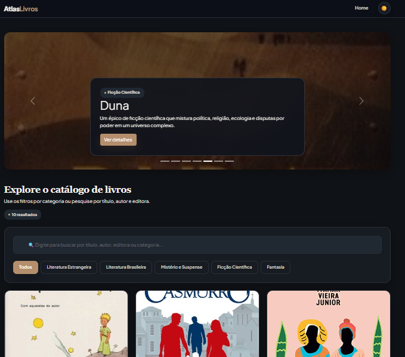
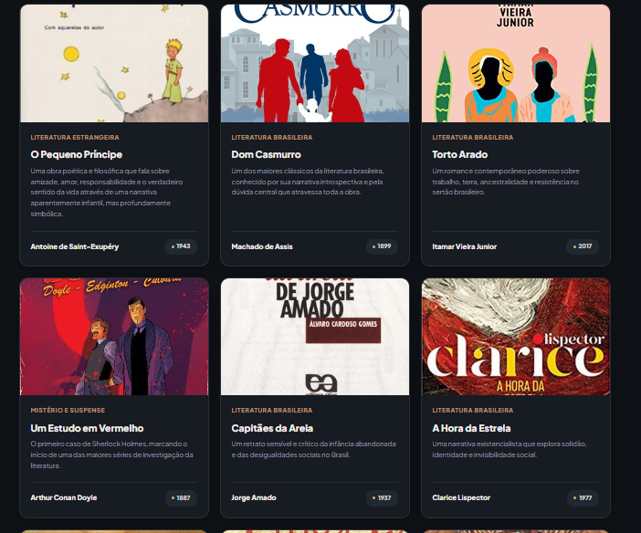
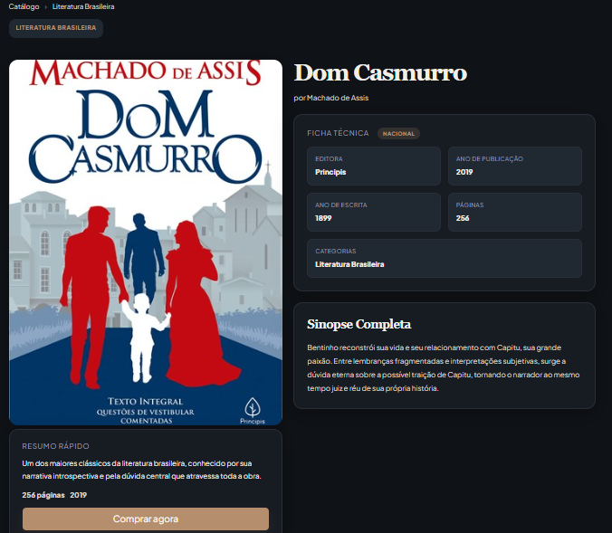
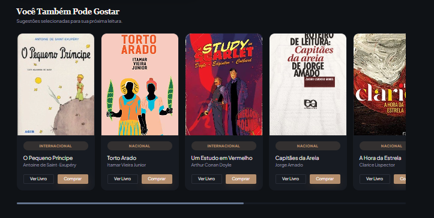

# Trabalho Prático - Semana 11

Nesta atividade, vamos dar continuidade ao projeto desenvolvido ao longo deste semestre, acrescentando a página de detalhes da aplicação.

Imagine que a página principal (home-page) mostre uma visão dos vários itens que existem no seu site. Ao clicar em um item, você é direcionado para a página de detalhes. A página de detalhes vai mostrar todas as informações sobre o item do seu projeto, seja esse item uma notícia, filme, receita, lugar turístico ou evento.

## Informações Gerais

- Nome: Felipe de Carvalho Andrade
- Matrícula: 902883
- Descreva brevemente seu projeto: Este projeto é uma aplicação web de catálogo de livros, organizada por categorias literárias como Literatura Brasileira, Ficção Científica, Mistério e Suspense, entre outras. Cada livro possui informações  detalhadas, incluindo título, autor, sinopse, descrição, editora, ano de publicação, número de páginas e imagem de capa.

---

## Prints do Trabalho

### Interface Completa (Home-Page)
<p align="center">
  
</p>

<p align="center">
  <em>Figura 1: Visão geral da página principal apresentando o banner rotativo de destaques (Duna), barra de pesquisa e os botões de filtros por categorias em pleno funcionamento.</em>
</p>

---

### Cards de Produtos
<p align="center">
  
</p>

<p align="center">
  <em>Figura 2: Exibição da grade de livros disponíveis no catálogo, renderizados dinamicamente a partir da base de dados com informações de título, autor e ano de lançamento.</em>
</p>

---

### Detalhes do Produto
<p align="center">
  
</p>

<p align="center">
  <em>Figura 3: Visualização da página interna de uma obra (Dom Casmurro) exibindo a capa em alta resolução, ficha técnica estruturada (Editora, Ano, Páginas) e a sinopse completa.</em>
</p>

---

### Recomendações Contextuais
<p align="center">
  
</p>

<p align="center">
  <em>Figura 4: Seção inferior da tela de detalhes exibindo sugestões automatizadas e carrossel de recomendações para incentivar a próxima leitura do usuário.</em>
</p>

---

## Dados em JSON
Abaixo está apresentada a estrutura de dados padronizada que alimenta dinamicamente a aplicação.

```json
{
  "livros": [
    {
      "id": 1,
      "titulo": "O Pequeno Príncipe",
      "autor": "Antoine de Saint-Exupéry",
      "categoria": "Literatura Estrangeira",
      "origem": "Internacional",
      "descricao": "Uma obra poética e filosófica que fala sobre amizade, amor, responsabilidade e o verdadeiro sentido da vida através de uma narrativa aparentemente infantil, mas profundamente simbólica.",
      "sinopse": "Após uma pane no deserto do Saara, um aviador conhece um pequeno príncipe vindo de outro planeta. Durante suas conversas, o garoto revela suas viagens por diferentes mundos e compartilha reflexões sobre relações humanas, solidão e valores essenciais que os adultos frequentemente esquecem.",
      "paginas": 96,
      "editora": "Agir",
      "anoPublicacao": 2018,
      "anoEscrita": 1943,
      "destaque": true,
      "imagem": "[https://covers.openlibrary.org/b/title/O%20Pequeno%20Príncipe-L.jpg](https://covers.openlibrary.org/b/title/O%20Pequeno%20Príncipe-L.jpg)"
    },
    {
      "id": 2,
      "titulo": "Dom Casmurro",
      "autor": "Machado de Assis",
      "categoria": "Literatura Brasileira",
      "origem": "Nacional",
      "descricao": "Um dos maiores clássicos da literatura brasileira, conhecido por sua narrativa introspectiva e pela dúvida central que atravessa toda a obra.",
      "sinopse": "Bentinho reconstrói sua vida e seu relacionamento com Capitu, sua grande paixão. Entre lembranças fragmentadas e interpretações subjetivas, surge a dúvida eterna sobre a possível traição de Capitu, tornando o narrador ao mesmo tempo juiz e réu de sua própria história.",
      "paginas": 256,
      "editora": "Principis",
      "anoPublicacao": 2019,
      "anoEscrita": 1899,
      "destaque": true,
      "imagem": "[https://covers.openlibrary.org/b/isbn/9788594318602-L.jpg](https://covers.openlibrary.org/b/isbn/9788594318602-L.jpg)"
    }
  ]
}
```